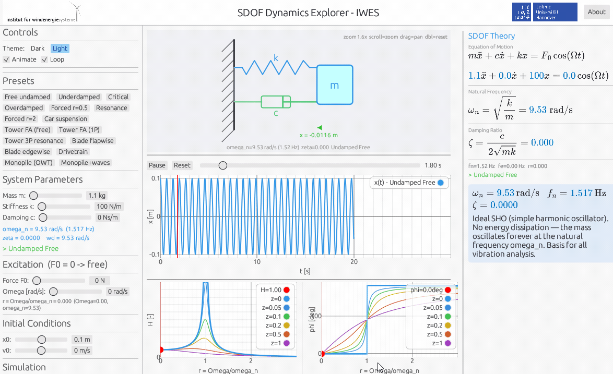

# SDOF Dynamics Explorer

An interactive educational tool for exploring **single-degree-of-freedom (SDOF) dynamics** — the fundamental building block of structural vibration analysis in wind energy engineering.

Built with Rust + egui. Runs natively on Windows (with rendered LaTeX equations) and in the browser via WebAssembly.

> Developed at the [Institut für Windenergiesysteme (IWES)](https://www.iwes.uni-hannover.de/), Leibniz Universität Hannover.



---

## Try It Online

**[Launch Web App →](https://IWES-LUH.github.io/sdof_dynamics)**

**[Download Latest Release →](../../releases/latest)** — native desktop binaries for Windows, Linux, and macOS with full LaTeX-rendered equations.

> **Note — equation rendering:** The web version displays equations using Unicode characters (e.g. `ω_n = √(k/m)`) rather than typeset LaTeX. This is a limitation of the Rust → WebAssembly compilation pipeline: the MathJax rendering engine depends on a V8 JavaScript runtime, which cannot itself be compiled to WASM. The desktop app renders all equations as proper LaTeX via an embedded MathJax/SVG pipeline.

---

## What Is an SDOF System?

A single-degree-of-freedom system is the simplest mechanical model of a vibrating structure: a **mass** (*m*) connected to a **spring** (*k*) and a **damper** (*c*), subject to an external harmonic force.

Despite its simplicity, the SDOF model captures the essential dynamics of nearly every real structure near one of its natural frequencies. The governing **equation of motion** is:

```
m·ẍ + c·ẋ + k·x = F₀·cos(Ω·t)
```

From this single equation, three dimensionless parameters control all behaviour:

| Parameter | Formula | Physical meaning |
|-----------|---------|-----------------|
| Natural frequency | ω_n = √(k/m) | Frequency at which the system oscillates freely |
| Damping ratio | ζ = c / (2·√(m·k)) | Fraction of critical damping; governs decay rate |
| Frequency ratio | r = Ω / ω_n | Ratio of excitation to natural frequency |

The **steady-state amplitude amplification** (dynamic magnification factor) is:

```
H(r, ζ) = 1 / √( (1 - r²)² + (2·ζ·r)² )
```

and the **phase lag** between force and response is:

```
φ = atan2( 2·ζ·r ,  1 − r² )        (0 ≤ φ ≤ π)
```

Using `atan2` (not plain `arctan`) is essential: for r > 1 the denominator is negative, and the lag must continue past π/2 toward π rather than wrapping back to negative values.

---

## Why SDOF Matters in Wind Energy

Wind turbines are large, flexible structures operating in a broadband dynamic environment — wind turbulence, wave loading, and rotor excitation all produce vibrations that must be understood and controlled. The SDOF model is the entry point for all of this analysis.

### Tower

The wind turbine tower is the most critical structural component from a dynamics perspective. Its first fore-aft (FA) bending mode governs the structural design.

- **Typical fn ≈ 0.25–0.35 Hz** for onshore turbines (5 MW class, hub height ~100 m)
- The rotor produces periodic excitation at the **1P frequency** (once per revolution) and **3P frequency** (blade-passing, three blades × rotational speed)
- At 12 rpm: 1P = 0.2 Hz, 3P = 0.6 Hz
- Tower designs target a natural frequency in the **"1P–3P gap"** (between 0.2 and 0.6 Hz) — the so-called *soft-stiff* design. Landing in either exclusion zone causes resonance-driven fatigue damage
- Structural damping is very low (ζ ≈ 1–2%), so even r values slightly off resonance can produce meaningful dynamic amplification

### Rotor Blades

Blades have multiple structural modes, of which two are most critical:

**Flapwise (out-of-plane):**
- Responds to aerodynamic thrust fluctuations
- fn ≈ 1.0 Hz for a 61 m blade (5 MW class)
- Aerodynamic damping is positive and substantial (ζ_eff ≈ 1–3%), aiding stability

**Edgewise (in-plane):**
- Responds to gravity loading (1P) and drag fluctuations
- fn ≈ 1.6 Hz for the same blade — stiffer due to structural design requirements
- **Aerodynamic damping is negative in edgewise** — the blade's own motion can feed energy back into vibration
- Net ζ can be very small (< 0.5%), making edgewise **flutter** a critical design constraint for large blades

### Drivetrain

The drivetrain (rotor hub → main shaft → gearbox → generator) has a first torsional resonance at fn ≈ 2 Hz. Excitation from grid events (voltage dips, emergency stops) can produce large torque spikes. Low damping (ζ ≈ 1–2%) means transient resonance excitation is a primary fatigue driver for gearbox components.

### Offshore Monopile

Offshore turbines on monopile foundations face an additional loading environment:

- Larger structural mass (rotor + nacelle + tower + pile ≈ 800 t) lowers fn to ≈ 0.25 Hz
- Soil and hydrodynamic damping raise total ζ to ≈ 2–3%
- First-order wave loading at typical periods of 8–12 s (0.08–0.12 Hz) excites the structure in the **quasi-static regime** (r ≈ 0.3–0.4), giving moderate amplification H ≈ 1.1–1.3
- Second-order wave forces and nonlinear effects can excite the natural frequency directly (*ringing*), making time-domain simulation essential for fatigue assessment

---

## Application Features

### Animated Schematic

A zoomable, pannable mass-spring-damper schematic updates in real time:
- The mass block moves with the numerically integrated displacement x(t)
- The spring stretches and compresses dynamically
- The damper piston tracks the motion
- A force arrow shows the instantaneous excitation F(t) when F₀ > 0
- Scroll to zoom · drag to pan · double-click to reset

### Time Response

RK4-integrated displacement x(t) and optionally velocity ẋ(t), with:
- Exponential decay envelope for underdamped free vibration
- Animated playhead tracking the current simulation time
- Transport controls (Run / Pause / Reset / time scrubber)

### Frequency Response Function (FRF)

Side-by-side plots of H(r) and φ(r):
- Five reference curves for ζ = 0.05, 0.1, 0.2, 0.5, 1.0
- Current system highlighted; operating point marked in red
- Instantly shows whether the system is in the sub-resonant, resonant, or isolation regime

### Theory Panel

Live-updating equations with current numerical values substituted for all parameters:
- ω_n, ζ, r, H(r), φ computed from current parameters
- Dynamic case label: *Undamped Free / Underdamped / Critically Damped / Overdamped / Forced Vibration / Resonance*
- **Desktop**: equations rendered as typeset LaTeX via MathJax → SVG
- **Browser**: equations displayed as Unicode text (e.g. `ζ = c / (2·√(m·k)) = 0.050`) — see the rendering note at the top of the README

### Presets

Sixteen one-click presets spanning generic dynamics and real wind energy components:

| Category | Preset | What it demonstrates |
|----------|--------|---------------------|
| Generic | Free undamped | Simple harmonic oscillator, eternal oscillation |
| Generic | Underdamped | Exponential amplitude decay, envelope visible |
| Generic | Critical | Fastest return to rest without oscillation |
| Generic | Overdamped | Pure exponential decay, sluggish return |
| Generic | Forced r = 0.5 | Sub-resonant forced response |
| Generic | Resonance | r ≈ 1, low ζ — amplitude growth |
| Generic | Forced r = 2 | Isolation regime, 180° phase flip |
| Generic | Car suspension | Quarter-car model, ζ ≈ 0.55 |
| Wind | Tower FA (free) | Onshore tower free vibration, fn ≈ 0.30 Hz |
| Wind | Tower FA (1P) | 1P rotor excitation, soft-stiff operating point |
| Wind | Tower 3P resonance | Resonance at blade-passing frequency — to be avoided |
| Wind | Blade flapwise | 1st flapwise mode, aerodynamic damping included |
| Wind | Blade edgewise | Low-damping mode, edgewise flutter risk |
| Wind | Drivetrain | 1st torsional mode, fn ≈ 2 Hz |
| Wind | Monopile (OWT) | Offshore monopile, soil+hydro damping |
| Wind | Monopile + waves | Quasi-static wave loading on monopile |

---

## Getting Started

### Web Version (no install)

Open the [live web app](https://IWES-LUH.github.io/sdof_dynamics) in any modern browser. All controls and plots work identically to the desktop version. Equations are rendered as Unicode text rather than LaTeX due to WebAssembly runtime constraints (see note above).

### Desktop Version (Windows / Linux / macOS)

[Download from the latest release](../../releases/latest) — no installer needed, single executable per platform. The Windows build requires a Vulkan-capable GPU driver (any modern GPU). All builds include typeset LaTeX equations in the theory panel via MathJax.

---

## Building from Source

### Prerequisites

- [Rust toolchain](https://rustup.rs/) (stable)
- For WASM: `rustup target add wasm32-unknown-unknown`

### Native Desktop (Windows, with LaTeX)

```bat
cargo build --release --bin sdof_dynamics --features mathjax
```

Output: `target/release/sdof_dynamics.exe`

### WebAssembly

```bat
build\BUILD_WEB.bat
```

Output in `dist/web/`: `index.html`, `sdof_dynamics_web.js`, `sdof_dynamics_web_bg.wasm`

Serve with `python -m http.server 8000` from `dist/web/`.

### Full Release (native + WASM → docs/)

```bat
build\release.bat
```

Builds both targets and copies all distributable files to `docs/`, ready to commit and push to GitHub Pages.

---

## Project Structure

```
sdof_dynamics/
├── apps/
│   └── sdof_dynamics.rs       # Full application (single source, dual-target)
├── shared/
│   ├── template.rs            # Reusable egui app framework (IWES theme, toolbar)
│   └── viewport3d.rs          # 3D camera controls (for future extensions)
├── web/
│   └── index.html             # Minimal WASM bootstrap page
├── build/
│   ├── release.bat            # Full release build → docs/ (Windows)
│   ├── release.sh             # Full release build → docs/ (Linux/macOS)
│   ├── BUILD_WEB.bat          # WASM-only build → dist/web/ (Windows)
│   └── build_web.sh           # WASM-only build → dist/web/ (Linux/macOS)
├── docs/                      # GitHub Pages root (committed build output)
│   ├── index.html
│   ├── sdof_dynamics_web.js
│   ├── sdof_dynamics_web_bg.wasm
│   └── sdof_dynamics.exe
└── Cargo.toml
```

---

## Physics Background

### Free Vibration

With no external force (F₀ = 0), the response depends on the damping ratio:

- **ζ = 0** (undamped): x(t) = x₀·cos(ω_n·t) + (v₀/ω_n)·sin(ω_n·t) — eternal oscillation
- **0 < ζ < 1** (underdamped): x(t) = A·exp(−ζ·ω_n·t)·cos(ω_d·t − θ), where ω_d = ω_n·√(1−ζ²)
- **ζ = 1** (critically damped): fastest possible non-oscillatory return to rest
- **ζ > 1** (overdamped): two real exponential decay modes, slower than critical

### Forced Vibration

With harmonic forcing F₀·cos(Ω·t), the steady-state amplitude is x_ss = H(r)·(F₀/k), where H(r) is the amplification factor. Three regimes:

| Regime | r range | Behaviour |
|--------|---------|-----------|
| Quasi-static | r ≪ 1 | H ≈ 1, response tracks force in phase |
| Resonance | r ≈ 1 | H → 1/(2ζ) ≫ 1 for small ζ, 90° phase lag |
| Isolation | r ≫ 1 | H → 0, response 180° out of phase |

At resonance (r = 1), H = 1/(2ζ). For a tower with ζ = 0.01, this gives amplification of 50× — explaining why even small rotor imbalances can cause large oscillations if the excitation frequency coincides with ω_n.

### Numerical Integration

The time response uses a **4th-order Runge-Kutta (RK4)** scheme with adaptive step count (up to 3000 points over t_end). RK4 provides excellent accuracy for the smooth harmonic forcing considered here. The cached solution is shared between the time plot, the animation, and the decay envelope — guaranteeing visual consistency.

---

## License

This project is released under the **MIT License** — © 2026 Institut für Windenergiesysteme (IWES), Leibniz Universität Hannover. See [LICENSE](LICENSE) for details.

### Third-Party Libraries

| Library | Version | License |
|---------|---------|---------|
| [egui / eframe / egui_plot](https://github.com/emilk/egui) | 0.29.x | MIT OR Apache-2.0 |
| [image](https://github.com/image-rs/image) | 0.25.9 | MIT OR Apache-2.0 |
| [wasm-bindgen / web-sys](https://github.com/rustwasm/wasm-bindgen) | 0.2.114 | MIT OR Apache-2.0 |
| [mathjax_svg](https://crates.io/crates/mathjax_svg) (+ MathJax) | 3.2.0 | Apache-2.0 |
| [resvg](https://github.com/linebender/resvg) | 0.44.0 | MPL-2.0 |

**resvg** is used under the Mozilla Public License 2.0. It is used here as an unmodified library dependency; no modifications have been made to any MPL-licensed files. The full MPL-2.0 text is at https://www.mozilla.org/en-US/MPL/2.0/.

See [THIRD_PARTY_LICENSES.md](THIRD_PARTY_LICENSES.md) for full details.
